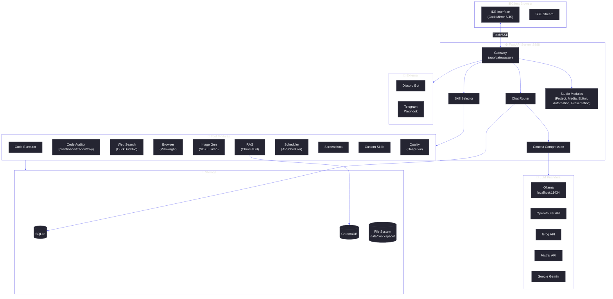
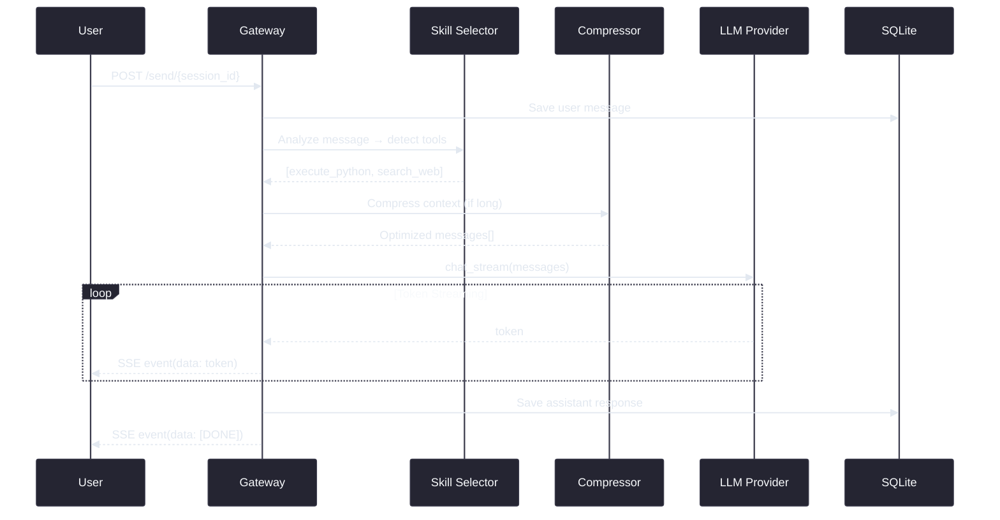
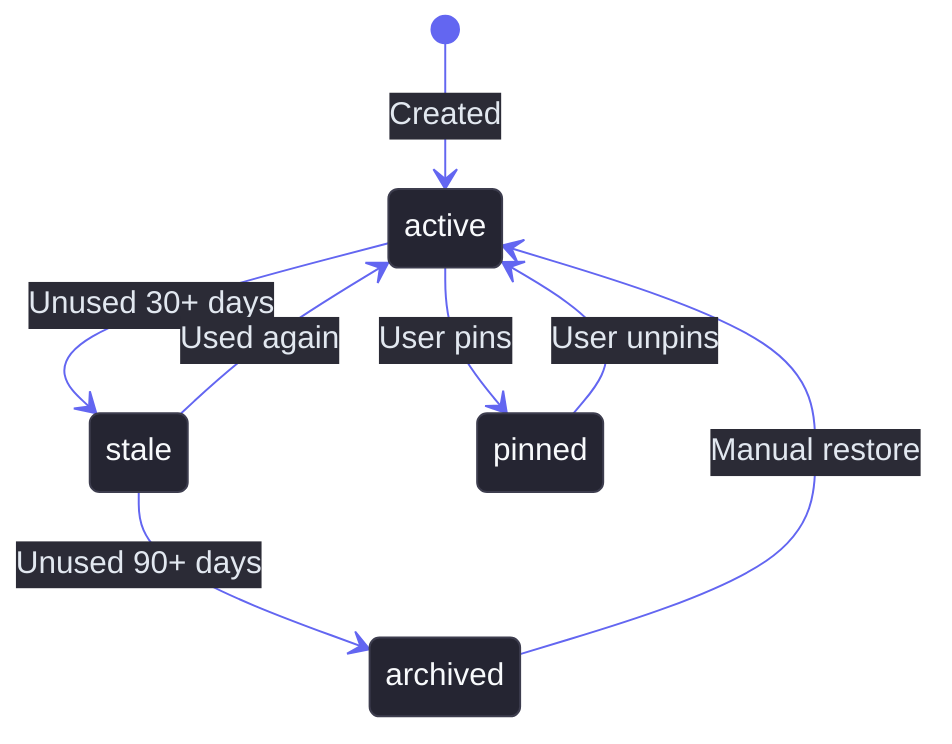

<div align="center">


# Clawzd

**An autonomous AI assistant with multi-provider LLM support, tool orchestration, and a premium IDE-style interface.**

[](https://python.org)
[](https://fastapi.tiangolo.com)
[](https://ollama.com)
[](https://opensource.org/licenses/MIT)

---

### Tech Stack

[]()
[]()
[]()
[]()
[]()
[]()
[]()
[]()
[]()

[]()
[]()
[]()
[]()
[]()
[]()
[]()

</div>

---

## 📋 Table of Contents

- [Overview](#-overview)
- [Architecture](#-architecture)
- [Features](#-features)
- [Requirements](#-requirements)
- [Installation](#-installation)
- [Configuration](#-configuration)
- [Usage](#-usage)
- [Skills System](#-skills-system)
- [Project Structure](#-project-structure)
- [API Reference](#-api-reference)
- [Integrations](#-integrations)

---

## ✨ Overview

Clawzd is a self-hosted, modular AI assistant that combines multiple LLM providers with an extensible tool/skill system. It features a dark-themed IDE-like web interface with real-time streaming, a full-featured code editor with AI autocomplete, code audit, RAG (Retrieval-Augmented Generation), browser automation, image generation, and more.

**Key Design Principles:**
- 🔌 **Multi-Provider** — Switch between Ollama (local), OpenRouter, Groq, Mistral, Google Gemini seamlessly
- 🛠️ **Tool Orchestration** — Auto-detect and invoke the right tool for each user query
- 📝 **IDE Editor** — Full code editor with tabs, AI autocomplete, code audit, git diff viewer
- 📡 **Real-time Streaming** — Server-Sent Events for token-by-token response display
- 🔒 **Self-Hosted** — All data stays on your machine; no external telemetry
- 🧩 **Extensible** — Create custom skills at runtime without restarting

---

## 🏗️ Architecture

### High-Level System Overview



### Request Lifecycle



---

## ✨ Features

| Category | Feature | Description |
|----------|---------|-------------|
| 💬 **Chat** | Multi-provider streaming | Switch LLM providers per-session or per-message |
| 💬 **Chat** | Pre-prompts | Configurable system prompts (developer, researcher, etc.) |
| 💬 **Chat** | AI Bypass | Obliteratus/Libertas-based architecture-specific bypass prompts |
| 💬 **Chat** | Context compression | Auto-summarizes long conversations to fit token limits |
| 💬 **Chat** | Token Optimization | Output compressor for 60-90% token savings |
| 💬 **Chat** | Auto-continuation | Automatically continues truncated LLM responses |
| 📝 **Editor** | Code editor | Full IDE with tabs, syntax highlighting, file explorer |
| 📝 **Editor** | AI autocomplete | Ghost-text LLM completions via local Ollama model |
| 📝 **Editor** | Agentic Mode | Build/Plan toggle with @file fuzzy search and AI change history |
| 📝 **Editor** | Code audit | One-click project audit (pylint, bandit, radon, trivy) |
| 📝 **Editor** | Git diff viewer | Side-by-side diff viewer for commits |
| 📝 **Editor** | Auto-save | File inactivity auto-save with visual indicator |
| 🎬 **Media Studio** | Asset gallery | Gallery viewer with SVG support and checkerboard background |
| 🎬 **Media Studio** | Lightbox viewer | Fullscreen asset preview |
| 🎬 **Media Studio** | Advanced Video | Multi-model video generation (AnimateDiff, LTX-Video, Wan2.1) |
| 🎬 **Media Studio** | Advanced Image | Streaming progress, image-to-image upload, resolution presets |
| 🚀 **Project Studio** | Task management | Kanban and table-based task tracking with plain-text import |
| 🚀 **Project Studio** | Export | Markdown (TODO.md) exports |
| ⚙️ **Automation Studio** | Custom workflows | Run custom automation pipelines |
| 📊 **Presentation Studio** | Dynamic UI | Editable presentation layouts with table customization |
| ⚔️ **Arena** | AI Battle Arena | Multi-model response comparison and automated judge evaluation |
| 🛠️ **Tools** | Code execution | Sandboxed Python with timeout & memory limits |
| 🛠️ **Tools** | Web search | DuckDuckGo integration |
| 🛠️ **Tools** | Browser automation | Playwright-based headless browsing |
| 🛠️ **Tools** | Image generation | SDXL Turbo local GPU + SVG vector generation |
| 🛠️ **Tools** | Screenshots | Local desktop + remote webpage capture |
| 🛠️ **Tools** | Audio Transcription | Local offline transcription via openai-whisper |
| 🛠️ **Tools** | Custom skills | Create new tools at runtime (Python/Shell) |
| 🔄 **Skills** | Skill Rebuilder | LLM-powered skill improvement with auto-backup & rollback |
| 🔄 **Skills** | Lifecycle management | Auto-transition (active → stale → archived) with pin protection |
| 🔄 **Skills** | Usage tracking | Per-skill execution history, error rates, and health reports |
| 📚 **RAG** | Knowledge base | Upload PDF/TXT/ZIP/TAR → ChromaDB vector search |
| ⏰ **Automation** | Cron scheduler | Schedule recurring LLM tasks (interval or cron) |
| 🔗 **Integrations** | Discord bot | Chat with Clawzd from Discord channels |
| 🔗 **Integrations** | Telegram bot | Auto-reply to Telegram messages via Bot API |
| ✅ **Quality** | DeepEval validation | Relevancy & hallucination scoring |
| 🔐 **Security** | Rate limiting | slowapi-based request throttling |
| 🔐 **Security** | Input sanitization | XSS prevention on user input |
| 📊 **Monitoring** | Token counter | Real-time input/output token telemetry |
| 📊 **Monitoring** | Performance Dash | Granular provider rate-limit and usage tracking |
| 📊 **Monitoring** | Request metrics | Latency tracking and performance dashboard |

---

## 📦 Requirements

### System

| Requirement | Minimum | Recommended |
|-------------|---------|-------------|
| **OS** | Ubuntu 22.04 / Debian 12 / macOS | Ubuntu 24.04 / macOS (M1/M2+) |
| **Python** | 3.11 | 3.12+ |
| **RAM** | 8 GB | 32 GB (for local LLM) |
| **GPU** | — | NVIDIA RTX (12+ GB VRAM) |
| **Disk** | 20 GB | 100 GB (with models) |
| **Tools** | `curl`, `git` | + `nvidia-smi`, Ollama (Homebrew on Mac) |
| **Browser** | Firefox / Chrome | Firefox / Chrome (fully tested) |


### Frontend Dependencies

- **CodeMirror 6** — Robust code editor component
- **Chart.js** — AI-driven data visualization
- **Mermaid.js** — Flowchart and diagram rendering
- **Highlight.js** — Syntax highlighting for code blocks
- **Lucide Icons** — SVG icon library for the UI

---

## 🚀 Installation

### Quick Start

The fastest way to install Clawzd is using our one-line installation script:
```bash
curl -fsSL https://raw.githubusercontent.com/omnia-projetcs/clawsd/main/install.sh | bash
```

Alternatively, you can install it by cloning the repository:

```bash
# 1. Clone the repository
git https://github.com/omnia-projetcs/clawsd.git
cd clawsd

# 2. Run the install script (creates venv, installs Ollama, deps, model, assets)
chmod +x install.sh
./install.sh

# 3. Configure your API keys (optional, for cloud providers)
nano .env

# 4. Launch
./run.sh
```

Then open **http://localhost:8888** in your browser.

### Manual Installation

If you prefer to install step by step:

```bash
# Create virtual environment
python3 -m venv .venv
source .venv/bin/activate
pip install --upgrade pip setuptools wheel

# Install Ollama
curl -fsSL https://ollama.com/install.sh | sh
ollama pull qwen3.5:9b

# Install all other dependencies
pip install -r requirements.txt

# Install Playwright browsers
python -m playwright install chromium
sudo python -m playwright install-deps chromium

# Create data directories
mkdir -p data/{sessions,profiles,skills,images,screenshots,audit_reports} workspace chroma_db

# Setup config
cp .env.example .env
```

---

## ⚙️ Configuration

All configuration is done via the `.env` file at the project root.

### `.env` Reference

```bash
# ============================================================
# Clawzd — Environment Configuration
# Copy this file to .env and fill in your values.
# ============================================================

# --- LLM Providers ---
# Available: ollama | google | grok | groq | huggingface | mistral | openai | openrouter
LLM_PROVIDER=ollama
GOOGLE_API_KEY=
GROK_API_KEY=
GROQ_API_KEY=
HUGGINGFACE_API_KEY=
MISTRAL_API_KEY=
OPENAI_API_KEY=
OPENROUTER_API_KEY=
TAVILY_API_KEY=

# --- Ollama (local LLM backend) ---
OLLAMA_HOST=http://localhost:11434
OLLAMA_MODEL=qwen3.5:9b
OLLAMA_NUM_GPU=999
OLLAMA_NUM_CTX=-1

# --- Application Paths (defaults are relative to project root) ---
# CHROMA_DB_PATH=
# DATA_DIR=
# WORKSPACE_DIR=
# STATIC_DIR=
# TEMPLATES_DIR=
# AGENTS_DIR=
# DB_PATH=
# SETTINGS_PATH=

# --- Security ---
API_SECRET_TOKEN=                     # empty = no auth required
CORS_ORIGINS=                         # comma-separated origins, empty = allow all
RATE_LIMIT=30/minute

# --- Notifications ---
SLACK_WEBHOOK_URL=
NOTIFICATION_EMAIL=
SMTP_HOST=
SMTP_PORT=587
SMTP_USER=
SMTP_PASSWORD=

# --- Social & Process Integrations ---
TWITTER_API_KEY=
TWITTER_API_SECRET=
TWITTER_ACCESS_TOKEN=
TWITTER_ACCESS_SECRET=
LINKEDIN_ACCESS_TOKEN=
LINKEDIN_AUTHOR_ID=
MEDIUM_INTEGRATION_TOKEN=
MEDIUM_AUTHOR_ID=
N8N_WEBHOOK_URL=

# --- Integrations ---
DISCORD_BOT_TOKEN=
TELEGRAM_BOT_TOKEN=

# --- Server ---
APP_HOST=0.0.0.0
APP_PORT=8888

# --- Debug ---
DEBUG=false
```

### Provider Setup

| Provider | API Key Env Var | Free Tier | Context Window |
|----------|----------------|-----------|----------------|
| **Local (Ollama)** | — | ✅ (self-hosted) | Model-dependent |
| **OpenRouter** | `OPENROUTER_API_KEY` | Limited | Model-dependent |
| **Groq** | `GROQ_API_KEY` | ✅ | 8K–128K |
| **Mistral** | `MISTRAL_API_KEY` | Limited | 8K–32K |
| **Google Gemini** | `GOOGLE_API_KEY` | ✅ | Up to 1M |

---

## 🎮 Usage

### Start the Application

```bash
./run.sh
# → Web application starts on :8888
# → Ollama must be running (ollama serve)
```

### Available Scripts

| Script | Description |
|--------|-------------|
| `./install.sh` | Full installation (venv, Ollama, deps, model, assets) |
| `./run.sh` | Start the application |
| `./update.sh` | Pull latest code + update dependencies + restart |
| `./uninstall.sh` | Uninstall the application (remove venv, data, and models) |

---

## 🧩 Skills System

Clawzd features a dynamic skill system that lets you create, execute, rebuild, and manage custom tools at runtime — no restart required.

### Creating Skills

#### Via the Chat

Ask the AI naturally and it will create the skill for you:

> "Create a skill that tracks cryptocurrency prices using CoinGecko API"

The LLM auto-detects the request, generates the Python code, writes it to `data/skills/`, and hot-loads it into the registry.

#### Via the API

```bash
# Create with auto-generated template
curl -X POST http://localhost:8888/skills/create \
  -H "Content-Type: application/json" \
  -d '{
    "name": "crypto_tracker",
    "description": "Track cryptocurrency prices in real-time",
    "category": "data",
    "parameters": ["symbol", "currency"],
    "triggers": ["(?i)\\bcrypto|bitcoin|eth\\b"]
  }'

# Create with custom code
curl -X POST http://localhost:8888/skills/create \
  -H "Content-Type: application/json" \
  -d '{
    "name": "my_tool",
    "description": "My custom tool",
    "category": "other",
    "code": "... full Python source code ..."
  }'
```

Every skill must inherit from `BaseSkill` and implement an async `execute()` method. See `/skills/template` for a starter template.

### Rebuilding Skills

The **Skill Rebuilder** uses the LLM to analyze and improve existing skills based on their execution history and error patterns.

#### Via the Chat

> "Rebuild the crypto_tracker skill to add retry logic for network errors"

The AI detects the rebuild intent and triggers the process automatically.

#### Via the API

```bash
# Rebuild with specific instruction
curl -X POST http://localhost:8888/skills/rebuild/crypto_tracker \
  -H "Content-Type: application/json" \
  -d '{"instruction": "add retry logic and better error handling"}'

# Rebuild without instruction (auto-improve from error history)
curl -X POST http://localhost:8888/skills/rebuild/crypto_tracker \
  -H "Content-Type: application/json" -d '{}'
```

#### Safety Mechanisms

| Mechanism | Description |
|-----------|-------------|
| **Automatic Backup** | Original code saved to `data/skills/.backups/` before overwrite |
| **AST Validation** | Generated code checked for syntax errors and BaseSkill compliance |
| **Auto-Rollback** | If the new code fails to load, the original is automatically restored |
| **Built-in Protection** | Built-in skills (`builtin_*.py`) cannot be rebuilt or archived |

### Skill Lifecycle Management

Skills follow an automatic lifecycle:



- **Active** — Loaded and available for execution
- **Stale** — Still loaded but flagged for review (unused for 30+ days)
- **Archived** — Moved to `data/skills/.archive/`, unregistered (unused for 90+ days)
- **Pinned** — User-protected, never auto-transitioned

Background maintenance runs every 6 hours to apply state transitions automatically.

#### Lifecycle API

```bash
# Pin a skill (prevent auto-archive)
curl -X POST http://localhost:8888/skills/pin/crypto_tracker

# Unpin a skill
curl -X POST http://localhost:8888/skills/unpin/crypto_tracker

# Manually archive a skill
curl -X POST http://localhost:8888/skills/archive/old_skill

# Restore from archive
curl -X POST http://localhost:8888/skills/restore/old_skill
```

### Monitoring & Health

```bash
# Full health report (all skills with usage stats, states, error rates)
curl http://localhost:8888/skills/health

# Usage history for a specific skill
curl http://localhost:8888/skills/usage/crypto_tracker
```

The health report includes:
- Total active and archived skill counts
- Per-skill usage statistics (execution count, success/failure rate, average time)
- Lifecycle state for each skill
- Source classification (builtin vs. user-created)

---

## 📁 Project Structure

```
Clawzd/
├── main.py                  # Entry point — health check + FastAPI launch
├── config.py                # Centralized .env configuration
├── install.sh               # Automated installer
├── run.sh                   # Launch script
├── update.sh                # Update + restart script
├── requirements.txt         # Python dependencies
├── .env                     # Local configuration (API keys)
├── .env.example             # Configuration template
│
├── app/                     # Application modules
│   ├── core/                # Core orchestration (agent, memory, gateway)
│   ├── routers/             # API routes and endpoints
│   ├── tools/               # Specific tool implementations (code, web, browser...)
│   ├── integrations/        # Discord, Telegram, Social integrations
│   ├── ai_models/           # LLM providers and model management
│   ├── automation/          # Playbooks and cron tasks
│   └── skills/              # Dynamic skill registry and lifecycle management
│
├── profiles/                # User profile and memory storage (Markdown)
├── models/                  # Local models directory
├── templates/               # Jinja2 HTML templates
├── static/                  # CSS, JS, fonts, images
│   ├── css/style.css        # Main application stylesheet
│   ├── js/app.js            # Frontend application logic
│   └── img/icon.png         # Project icon
├── data/                    # Runtime data (DB, sessions, images, audit reports…)
├── workspace/               # User workspace for file operations
└── chroma_db/               # ChromaDB vector store
```

---

## 🔌 API Reference

All endpoints are served from `http://localhost:8888`.

### Core

| Method | Endpoint | Description |
|--------|----------|-------------|
| `GET` | `/` | Main web interface |
| `POST` | `/send/{session_id}` | Send message + trigger LLM |
| `GET` | `/stream/{session_id}` | SSE token stream |
| `GET` | `/health` | Health check with dependency status |
| `GET` | `/api/providers` | List LLM providers & models |
| `GET` | `/api/preprompts` | List pre-prompt templates |
| `GET` | `/api/metrics` | System & request metrics |
| `GET` | `/api/llm-status` | Ollama connection status |

### Tools

| Prefix | Endpoints | Module |
|--------|-----------|--------|
| `/chat` | Sessions CRUD | `chat.py` |
| `/profile` | Profiles CRUD | `profiles.py` |
| `/code` | `/execute`, `/audit`, `/audit/report/{id}` | `tools_code.py` |
| `/web` | `/search` | `tools_web.py` |
| `/local` | Whitelisted shell commands | `tools_local.py` |
| `/quality` | `/validate`, `/feedback` | `tools_quality.py` |
| `/rag` | `/add`, `/search`, `/stats` | `rag.py` |
| `/improve` | Self-improvement module | `improvement.py` |
| `/agent` | `/execute` | `agent_core.py` |
| `/api` | `/settings`, `/memory`, `/enhance` | `settings.py, memory.py, enhance.py` |
| `/screenshot` | `/local`, `/remote` | `tools_screenshot.py` |
| `/image` | `/generate`, `/gallery` | `tools_image.py` |
| `/audio` | Audio tools | `tools_audio.py` |
| `/browser` | `/navigate`, `/click`, `/type`, `/extract` | `tools_browser.py` |
| `/cron` | `/jobs` CRUD, `/toggle` | `tools_cron.py` |
| `/skills` | `/create`, `/list`, `/rebuild`, `/pin` | `tools_skills.py` |
| `/document` | Document operations | `tools_document.py` |
| `/telegram` | `/webhook` | `integrations_telegram.py` |
| `/models` | `/list`, `/pull`, `/delete`, `/status` | `model_manager.py` |
| `/presentation` | Presentation tools | `tools_presentation.py` |
| `/automation` | Automation tools | `tools_automation.py` |
| `/docgen` | Document generation | `tools_document_gen.py` |
| `/research` | Research tools | `tools_research.py` |
| `/twitter` | Twitter integrations | `tools_twitter.py` |
| `/project` | Project and task management | `tools_project.py` |
| `/spec` | Specifications tools | `tools_spec.py` |
| `/agents` | Agent dispatch | `agent_dispatch.py` |
| `/playbook` | Playbook engine | `playbook_engine.py` |

---

## 🔗 Integrations

### Discord Bot

1. Create a bot at [Discord Developer Portal](https://discord.com/developers/applications)
2. Enable **Message Content Intent**
3. Add to `.env`:
   ```bash
   DISCORD_BOT_TOKEN=your-bot-token
   DISCORD_CHANNEL_IDS=channel_id_1,channel_id_2
   ```
4. Restart Clawzd — the bot starts automatically

### Telegram Bot

1. Create a bot via [@BotFather](https://t.me/BotFather) on Telegram
2. Set webhook URL: `https://your-domain/telegram/webhook`
3. Add to `.env`:
   ```bash
   TELEGRAM_BOT_TOKEN=your-bot-token
   TELEGRAM_ALLOWED_IDS=your-user-id  # Optional: Comma-separated allowlist
   ```

---

## 🔒 HTTPS / TLS Setup

Clawzd runs on HTTP by default. For production or remote access, use a reverse proxy with TLS:

### Nginx + Let's Encrypt

```nginx
server {
    listen 443 ssl http2;
    server_name clawzd.yourdomain.com;

    ssl_certificate /etc/letsencrypt/live/clawzd.yourdomain.com/fullchain.pem;
    ssl_certificate_key /etc/letsencrypt/live/clawzd.yourdomain.com/privkey.pem;

    location / {
        proxy_pass http://127.0.0.1:8888;
        proxy_http_version 1.1;
        proxy_set_header Upgrade $http_upgrade;
        proxy_set_header Connection "upgrade";
        proxy_set_header Host $host;
        proxy_set_header X-Real-IP $remote_addr;
        proxy_set_header X-Forwarded-For $proxy_add_x_forwarded_for;
        proxy_set_header X-Forwarded-Proto $scheme;

        # SSE support — disable buffering
        proxy_buffering off;
        proxy_cache off;
        proxy_read_timeout 300;
    }
}
```

### Security Hardening

| Feature | Config | Description |
|---------|--------|-------------|
| **Rate Limiting** | `RATE_LIMIT=30/minute` | Prevents abuse via slowapi |
| **CORS** | `CORS_ORIGINS=https://your.domain` | Restricts cross-origin access |
| **Input Sanitization** | Built-in | Script tags stripped from user input |
| **Sandbox** | Built-in | Code execution isolated with resource limits |

---

## 🤝 Contributing

1. Fork the repository
2. Create a feature branch: `git checkout -b feature/my-feature`
3. Commit your changes: `git commit -m 'feat: add my feature'`
4. Push to the branch: `git push origin feature/my-feature`
5. Open a Pull Request

---

<div align="center">

**Built with ❤️ using FastAPI, Ollama, and open-source AI models.**

</div>

---

## 🙏 Acknowledgements

We would like to thank the following open-source projects that served as inspiration for Clawzd:

- **Open WebUI**
- **AnythingLLM**
- **ComfyUI**
- **Ollama**
- **FastAPI**
- **Playwright**
- **Hermes Agent** (https://github.com/NousResearch/hermes-agent) for memory, compression, and tool repair logic.
- **Graphify** (https://github.com/closedloop-technologies/graphify)
- **RTK Token Optimization** (https://github.com/rtk-ai/rtk)
- **Obliteratus** (https://github.com/elder-plinius/OBLITERATUS) & **L1B3RT4S** (https://github.com/elder-plinius/L1B3RT4S) for system prompts.
