<div align="center">

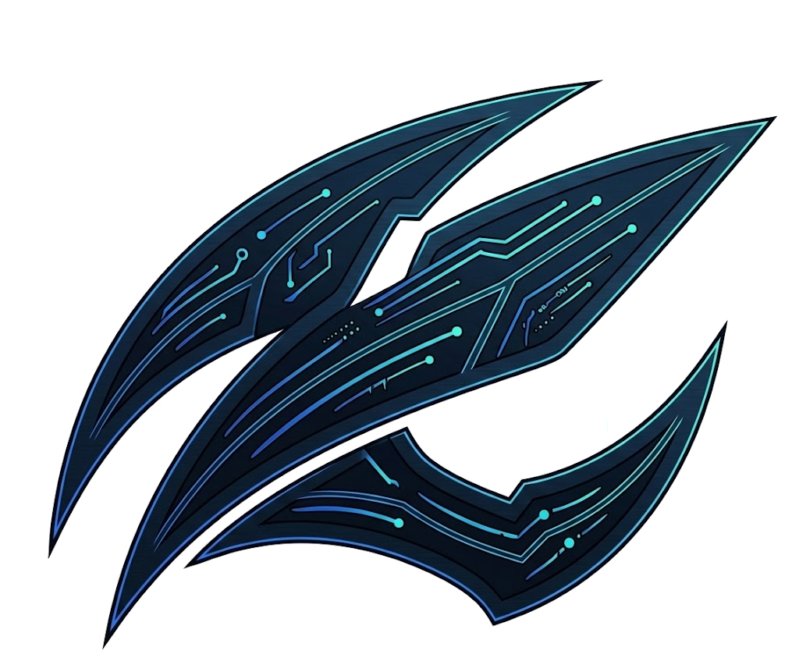

# Clawzd

**An autonomous AI assistant with multi-provider LLM support, tool orchestration, and a premium IDE-style interface.**

[](https://python.org)
[](https://fastapi.tiangolo.com)
[](https://ollama.com)
[](https://opensource.org/licenses/MIT)

---

### Tech Stack

[]()
[]()
[]()
[]()
[]()
[]()
[]()
[]()
[]()
[]()

[]()
[]()
[]()
[]()
[]()
[]()
[]()
[]()
[]()
[]()
[]()

</div>

---

## 📋 Table of Contents

- [Overview](#-overview)
- [Architecture](#-architecture)
- [Features](#-features)
- [Requirements](#-requirements)
- [Installation](#-installation)
- [Configuration](#-configuration)
- [Image Generation Models](#-image-generation-models)
- [Usage](#-usage)
- [Skills System](#-skills-system)
- [Project Structure](#-project-structure)
- [API Reference](#-api-reference)
- [Integrations](#-integrations)

---

## ✨ Overview

Clawzd is a self-hosted, modular AI assistant that combines multiple LLM providers with an extensible tool/skill system. Built on Agentic / Plugin architecture, it features a plugin system, tool replay engine, app builder, and a dark-themed IDE-like web interface with real-time streaming, code editing, code audit, RAG, browser automation, image generation, and more.

**Key Design Principles:**
- 🔌 **Multi-Provider** — Switch between Ollama (local), OpenRouter, Groq, Mistral, Google Gemini, Anthropic seamlessly
- 🛠️ **Tool Orchestration** — Auto-detect and invoke the right tool for each user query
- 📝 **IDE Editor** — Full code editor with tabs, AI autocomplete, code audit, git diff viewer
- 📡 **Real-time Streaming** — Server-Sent Events for token-by-token response display
- 🔒 **Self-Hosted** — All data stays on your machine; no external telemetry
- 🧩 **Extensible** — Plugin system + runtime skill creation without restarting
- 🔄 **Observable** — Tool replay, system dashboard, and notification system built-in

---

## 🏗️ Architecture

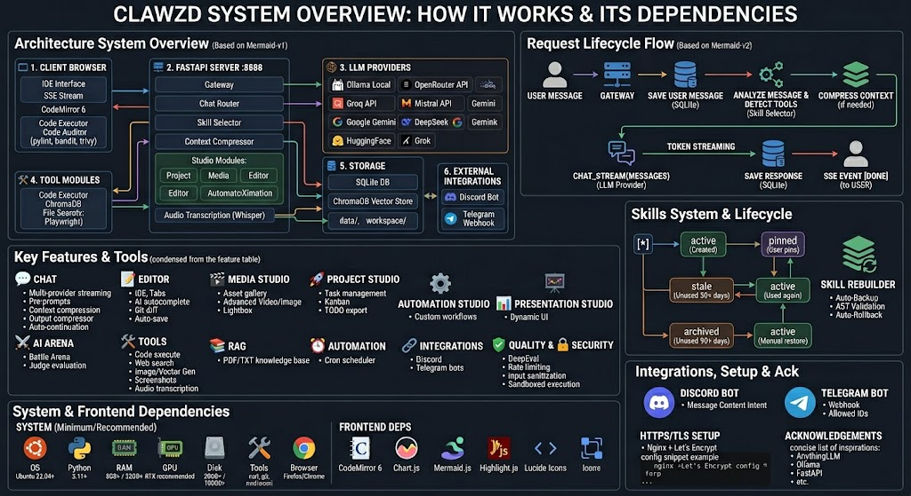
 
---

## 🖼️ Gallery

| Chat preview | Chat Dev Code | Chat Arena |
|---|---|---|
| 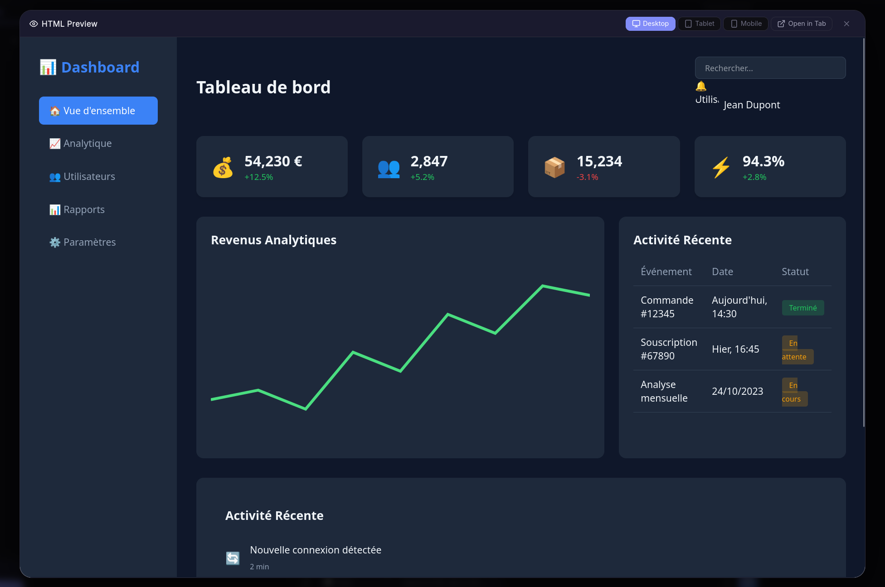 | 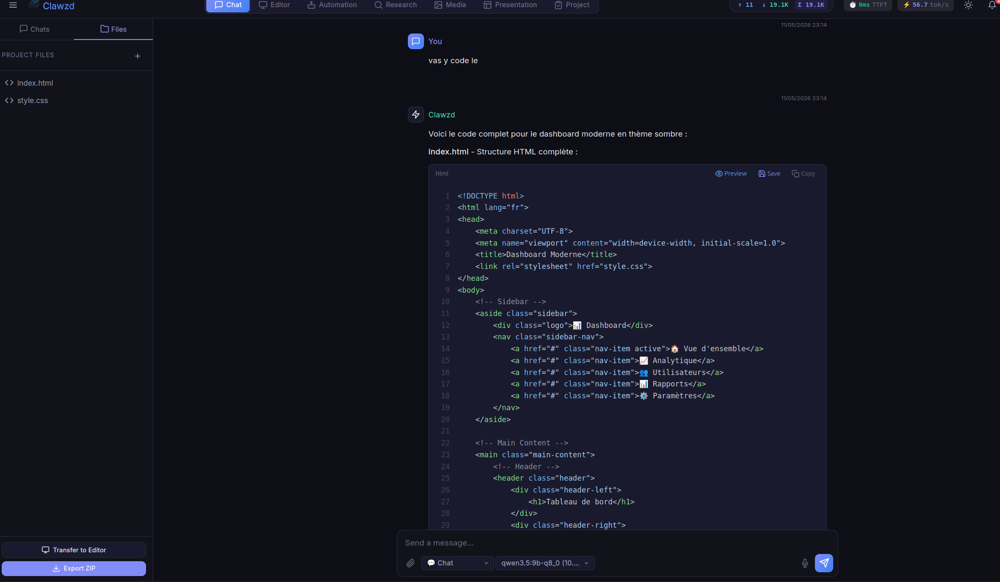 | 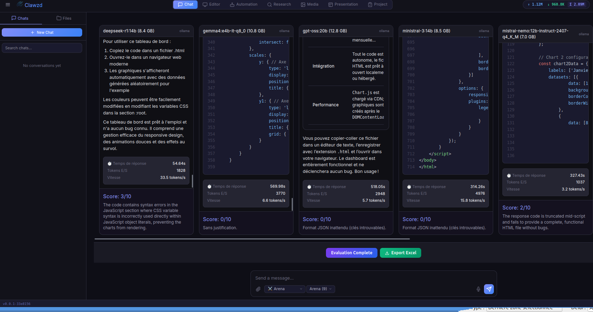 |

| Editor | Media Studio | Presentation |
|---|---|---|
| 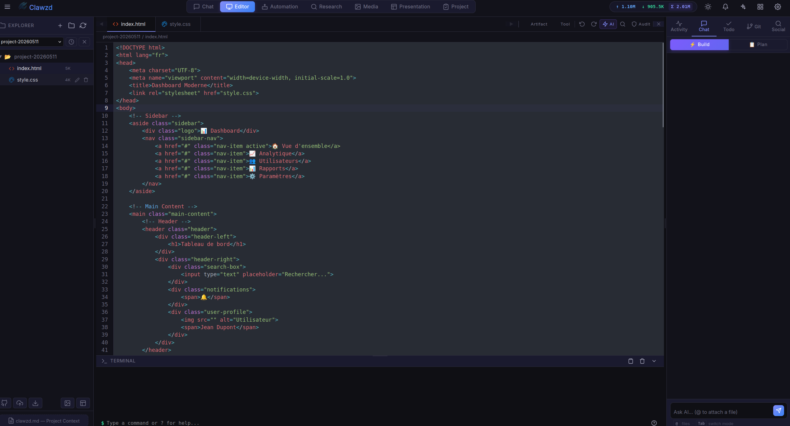 |  | 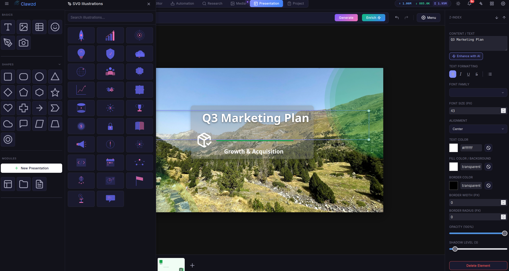 |

| Project Studio | Research |
|---|---|
| 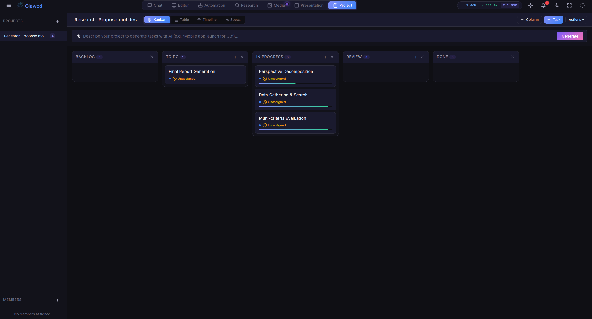 | 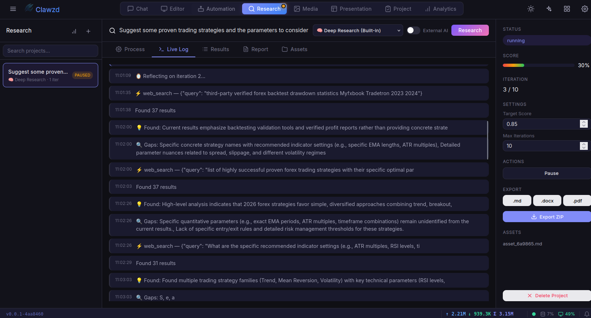 |


| Analytics | Automation |
|---|---|
| 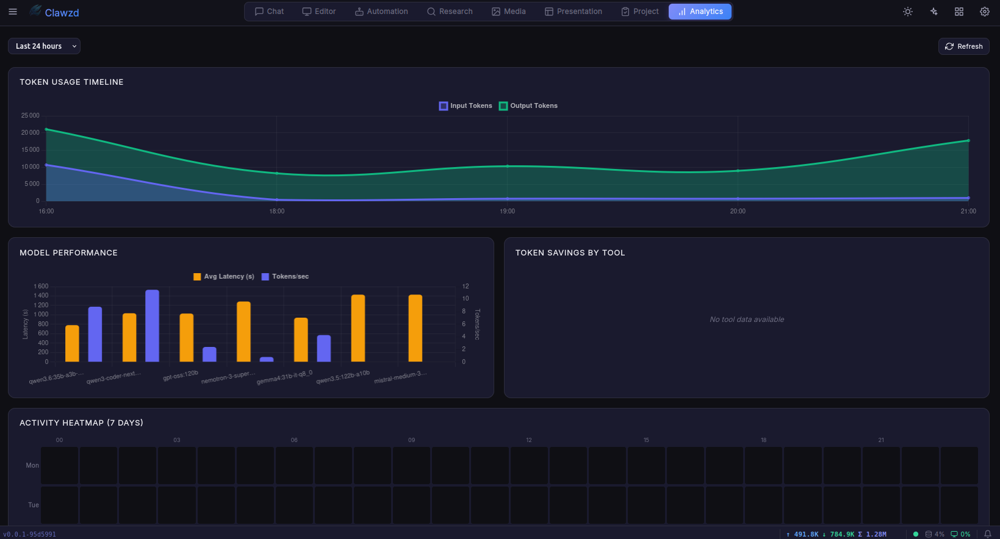 | 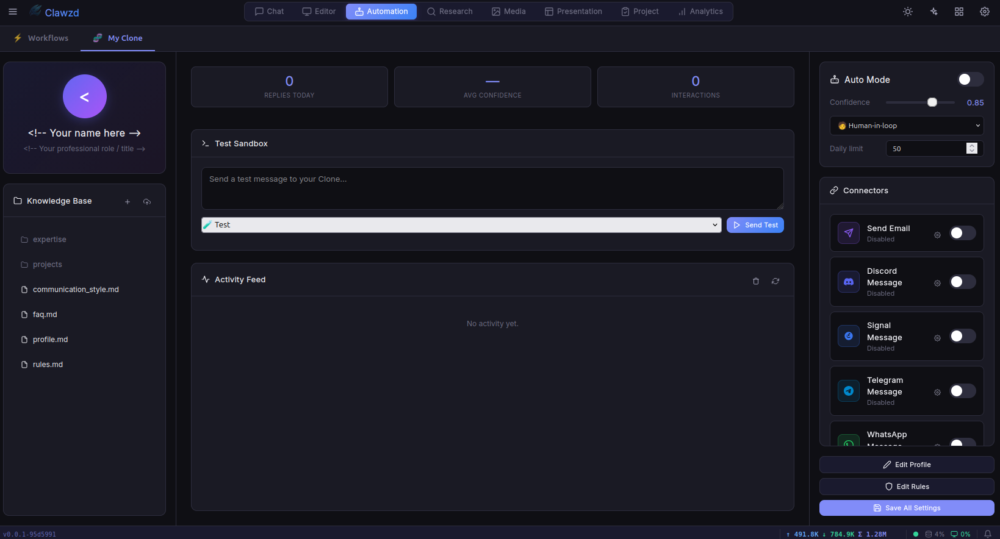 |

---

## ✨ Features

| Category | Feature | Description |
|----------|---------|-------------|
| 💬 **Chat** | Multi-provider streaming | Switch LLM providers per-session or per-message |
| 💬 **Chat** | Pre-prompts | Configurable system prompts (developer, researcher, etc.) |
| 💬 **Chat** | AI Bypass | Obliteratus/Libertas-based architecture-specific bypass prompts |
| 💬 **Chat** | Context compression | Auto-summarizes long conversations to fit token limits |
| 💬 **Chat** | Token Optimization | Output compressor for 60-90% token savings |
| 💬 **Chat** | Auto-continuation | Automatically continues truncated LLM responses |
| 📝 **Editor** | Code editor | Full IDE with tabs, syntax highlighting, file explorer |
| 📝 **Editor** | AI autocomplete | Ghost-text LLM completions via local Ollama model |
| 📝 **Editor** | Agentic Mode | Build/Plan toggle with @file fuzzy search and AI change history |
| 📝 **Editor** | Code audit | One-click project audit (pylint, bandit, radon, trivy) |
| 📝 **Editor** | Git diff viewer | Side-by-side diff viewer for commits |
| 📝 **Editor** | Auto-save | File inactivity auto-save with visual indicator |
| 🎬 **Media Studio** | Asset gallery | Gallery viewer with SVG support and checkerboard background |
| 🎬 **Media Studio** | Lightbox viewer | Fullscreen asset preview |
| 🎬 **Media Studio** | Advanced Video | Multi-model video generation (AnimateDiff, LTX-Video, Wan2.1) |
| 🎬 **Media Studio** | Advanced Image | Streaming progress, image-to-image upload, resolution presets |
| 🚀 **Project Studio** | Task management | Kanban and table-based task tracking with plain-text import |
| 🚀 **Project Studio** | Export | Markdown (TODO.md) exports |
| ⚙️ **Automation Studio** | Custom workflows | Run custom automation pipelines |
| 📊 **Presentation Studio** | Dynamic UI | Editable presentation layouts with table customization |
| ⚔️ **Arena** | AI Battle Arena | Multi-model response comparison and automated judge evaluation |
| 🛠️ **Tools** | Code execution | Sandboxed Python with timeout & memory limits |
| 🛠️ **Tools** | Web search | DuckDuckGo integration |
| 🛠️ **Tools** | Browser automation | Playwright-based headless browsing |
| 🛠️ **Tools** | Image generation | SDXL Turbo local GPU + SVG vector generation |
| 🛠️ **Tools** | Screenshots | Local desktop + remote webpage capture |
| 🛠️ **Tools** | Audio Transcription | Local offline transcription via openai-whisper |
| 🛠️ **Tools** | Custom skills | Create new tools at runtime (Python/Shell) |
| 🔄 **Skills** | Skill Rebuilder | LLM-powered skill improvement with auto-backup & rollback |
| 🔄 **Skills** | Lifecycle management | Auto-transition (active → stale → archived) with pin protection |
| 🔄 **Skills** | Usage tracking | Per-skill execution history, error rates, and health reports |
| 📚 **RAG** | Knowledge base | Upload PDF/TXT/ZIP/TAR → ChromaDB vector search |
| ⏰ **Automation** | Cron scheduler | Schedule recurring LLM tasks (interval or cron) |
| 🔗 **Integrations** | Discord bot | Chat with Clawzd from Discord channels |
| 🔗 **Integrations** | Telegram bot | Auto-reply to Telegram messages via Bot API |
| ✅ **Quality** | DeepEval validation | Relevancy & hallucination scoring |
| 🔐 **Security** | Rate limiting | slowapi-based request throttling |
| 🔐 **Security** | Input sanitization | XSS prevention on user input |
| 📊 **Monitoring** | Token counter | Real-time input/output token telemetry |
| 📊 **Monitoring** | Performance Dash | Granular provider rate-limit and usage tracking |
| 📊 **Monitoring** | Request metrics | Latency tracking and performance dashboard |
| 🔌 **Plugins** | Plugin system | 7-hook lifecycle, auto-discovery, REST management |
| 🔄 **Replay** | Tool Replay | Record, inspect, and export tool execution sequences |
| 🏗️ **Builder** | App Builder | LLM-driven mini-app generation with live preview |
| 📊 **Dashboard** | System Dashboard | Aggregated health metrics from 8 subsystems |
| 📄 **Artifacts** | Artifact Store | Persistent code/doc artifact extraction and management |
| 📤 **Storage** | Upload Store | Checksummed asset registration and management |
| 🔔 **Notifications** | Notification System | In-app notification queue with badge and polling |
| 📐 **UI** | Structured UI | Dynamic __CHART__, __TABLE__, __CARD__ rendering |
| ⌨️ **UX** | Keyboard Shortcuts | Ctrl+Shift+A/R/D/B/G panel toggles |
| 📱 **Mobile** | Responsive UI | 5-breakpoint mobile-first CSS architecture |

---

## 📦 Requirements

### System

| Requirement | Minimum | Recommended |
|-------------|---------|-------------|
| **OS** | Ubuntu 22.04 / Debian 12 / macOS | Ubuntu 24.04 / macOS (M1/M2+) |
| **Python** | 3.11 | 3.12+ |
| **RAM** | 8 GB | 32 GB (for local LLM) |
| **GPU** | — | NVIDIA RTX (12+ GB VRAM) |
| **Disk** | 20 GB | 100 GB (with models) |
| **Tools** | `curl`, `git` | + `nvidia-smi`, Ollama (Homebrew on Mac) |
| **Browser** | Firefox / Chrome | Firefox / Chrome (fully tested) |


### Frontend Dependencies

- **CodeMirror 6** — Robust code editor component
- **Chart.js** — AI-driven data visualization
- **Mermaid.js** — Flowchart and diagram rendering
- **Highlight.js** — Syntax highlighting for code blocks
- **Lucide Icons** — SVG icon library for the UI

---

## 🚀 Installation

### Quick Start

The fastest way to install Clawzd is using our one-line installation script:
```bash
curl -fsSL https://raw.githubusercontent.com/omnia-projetcs/clawsd/main/install.sh | bash
```

Alternatively, you can install it by cloning the repository:

```bash
# 1. Clone the repository
git https://github.com/omnia-projetcs/clawsd.git
cd clawsd

# 2. Run the install script (creates venv, installs Ollama, deps, model, assets)
chmod +x *.sh
./install.sh

# 3. Configure your API keys (optional, for cloud providers, you can use the setting menu too)
nano .env

# 4. Update 
./update.sh
```

Then open **http://localhost:8888** in your browser.

### Manual Installation

If you prefer to install step by step:

```bash
# Create virtual environment
python3 -m venv .venv
source .venv/bin/activate
pip install --upgrade pip setuptools wheel

# Install Ollama
curl -fsSL https://ollama.com/install.sh | sh
ollama pull qwen3.5:9b

# Install all other dependencies
pip install -r requirements.txt

# Install Playwright browsers
python -m playwright install chromium
sudo python -m playwright install-deps chromium

# Create data directories
mkdir -p data/{sessions,profiles,skills,images,screenshots,audit_reports} workspace chroma_db

# Setup config
cp .env.example .env
```

---

## ⚙️ Configuration

All configuration is done via the `.env` file at the project root.

### `.env` Reference

```bash
# ============================================================
# Clawzd — Environment Configuration
# Copy this file to .env and fill in your values.
# ============================================================

# --- LLM Providers ---
# Available: ollama | vllm | anthropic | google | grok | groq | huggingface | mistral | openai | openrouter
LLM_PROVIDER=ollama
GOOGLE_API_KEY=
GROK_API_KEY=
GROQ_API_KEY=
HUGGINGFACE_API_KEY=
MISTRAL_API_KEY=
OPENAI_API_KEY=
OPENROUTER_API_KEY=
TAVILY_API_KEY=

# --- Ollama (local LLM backend) ---
OLLAMA_HOST=http://localhost:11434
OLLAMA_MODEL=qwen3.5:9b
OLLAMA_NUM_GPU=999
OLLAMA_NUM_CTX=-1                     # -1 = dynamic (auto-sized per request)

# --- vLLM (optional local/remote backend) ---
VLLM_HOST=http://localhost:8000
VLLM_API_KEY=
VLLM_MODEL=                           # leave empty to auto-detect
```

### 🚀 Ollama Performance Tuning

Clawzd automatically optimizes Ollama performance with **dynamic context sizing** — the `num_ctx` and `num_predict` are calculated per request based on the actual input size, instead of always using the model's maximum. This dramatically reduces VRAM usage for short conversations.

For maximum performance, also configure these **on the Ollama server** (where `ollama serve` runs):

#### Systemd (default Linux install)

If Ollama was installed via `curl -fsSL https://ollama.com/install.sh | sh`, it runs as a systemd service. Add the variables to the service file:

```bash
# 1. Edit the service file
sudo nano /etc/systemd/system/ollama.service

# 2. Add these lines in the [Service] section (before ExecStart=):
#    Environment="OLLAMA_FLASH_ATTENTION=1"
#    Environment="OLLAMA_KV_CACHE_TYPE=q8_0"

# 3. Reload and restart
sudo systemctl daemon-reload
sudo systemctl restart ollama

# 4. Verify
systemctl show ollama | grep -i environment
```

#### Manual / macOS / Docker

If you run `ollama serve` manually, export the variables in your shell profile:

```bash
# Add to ~/.bashrc or ~/.zshrc
export OLLAMA_FLASH_ATTENTION=1
export OLLAMA_KV_CACHE_TYPE=q8_0

# Then restart Ollama
ollama serve
```

| Variable | Where | Effect |
|----------|-------|--------|
| `OLLAMA_FLASH_ATTENTION=1` | Ollama server | Tiled attention computation, massive VRAM savings for long contexts |
| `OLLAMA_KV_CACHE_TYPE=q8_0` | Ollama server | Quantizes the KV cache from f16 to q8_0, ~2x memory reduction |
| `OLLAMA_NUM_CTX=-1` | Clawzd `.env` | Dynamic: auto-sizes context per request (default, recommended) |
| `OLLAMA_NUM_CTX=8192` | Clawzd `.env` | Fixed ceiling: never exceed 8192 tokens |
| `OLLAMA_NUM_GPU=999` | Clawzd `.env` | Number of GPU layers (999 = all layers on GPU) |

> ⚠️ `OLLAMA_FLASH_ATTENTION` and `OLLAMA_KV_CACHE_TYPE` are **Ollama server variables** — they must be set on the machine running `ollama serve`, not in Clawzd's `.env`.

```bash

# --- Application Paths (defaults are relative to project root) ---
# CHROMA_DB_PATH=
# DATA_DIR=
# WORKSPACE_DIR=
# STATIC_DIR=
# TEMPLATES_DIR=
# AGENTS_DIR=
# DB_PATH=
# SETTINGS_PATH=

# --- Security ---
API_SECRET_TOKEN=                     # empty = no auth required
CORS_ORIGINS=                         # comma-separated origins, empty = allow all
RATE_LIMIT=30/minute

# --- Notifications ---
SLACK_WEBHOOK_URL=
NOTIFICATION_EMAIL=
SMTP_HOST=
SMTP_PORT=587
SMTP_USER=
SMTP_PASSWORD=

# --- Social & Process Integrations ---
TWITTER_API_KEY=
TWITTER_API_SECRET=
TWITTER_ACCESS_TOKEN=
TWITTER_ACCESS_SECRET=
LINKEDIN_ACCESS_TOKEN=
LINKEDIN_AUTHOR_ID=
MEDIUM_INTEGRATION_TOKEN=
MEDIUM_AUTHOR_ID=
N8N_WEBHOOK_URL=

# --- Integrations ---
DISCORD_BOT_TOKEN=
TELEGRAM_BOT_TOKEN=

# --- Server ---
APP_HOST=0.0.0.0
APP_PORT=8888

# --- Debug ---
DEBUG=false
```

### Provider Setup

| Provider | API Key Env Var | Free Tier | Context Window |
|----------|----------------|-----------|----------------|
| **Local (Ollama)** | — | ✅ (self-hosted) | Model-dependent |
| **Local (vLLM)** | `VLLM_API_KEY` | ✅ (self-hosted) | Model-dependent |
| **OpenRouter** | `OPENROUTER_API_KEY` | Limited | Model-dependent |
| **Groq** | `GROQ_API_KEY` | ✅ | 8K–128K |
| **Mistral** | `MISTRAL_API_KEY` | Limited | 8K–32K |
| **Google Gemini** | `GOOGLE_API_KEY` | ✅ | Up to 1M |
| **Anthropic Claude** | `ANTHROPIC_API_KEY` | ❌ Pay-as-you-go | 200K |
| **Grok (xAI)** | `GROK_API_KEY` | ✅ (limited) | 128K |
| **HuggingFace** | `HUGGINGFACE_API_KEY` | ✅ | Model-dependent |
| **Tavily** | `TAVILY_API_KEY` | ✅ (1000 req/mo) | — (Search API) |

### 🔑 API Keys & Tokens — How to Get Them

Below is the step-by-step process for every provider. Click the links to go directly to the token creation page.

---

#### Ollama (Local — No Token Required)

Ollama runs locally on your machine. **No API key or subscription is needed.**

1. Install: `curl -fsSL https://ollama.com/install.sh | sh`
2. Pull a model: `ollama pull qwen3.5:9b`
3. It's ready — Clawzd connects automatically via `OLLAMA_HOST`.

> 💡 Set `OLLAMA_API_KEY` only if you use a remote/secured Ollama instance.

---

#### OpenAI

| | |
|---|---|
| **Subscription** | Pay-as-you-go (credit-based). Free $5 trial credit for new accounts. |
| **Create Token** | [platform.openai.com/api-keys](https://platform.openai.com/api-keys) |

1. Sign up or log in at [platform.openai.com](https://platform.openai.com/)
2. Go to **API Keys** → **Create new secret key**
3. Copy the key (starts with `sk-...`)
4. Paste into `.env`: `OPENAI_API_KEY=sk-...`

---

#### Google Gemini

| | |
|---|---|
| **Subscription** | ✅ Free tier available (15 RPM). Pay-as-you-go for higher limits. |
| **Create Token** | [aistudio.google.com/apikey](https://aistudio.google.com/apikey) |

1. Sign in with your Google account at [Google AI Studio](https://aistudio.google.com/)
2. Click **Get API key** → **Create API key**
3. Select or create a Google Cloud project
4. Copy the key (starts with `AIzaSy...`)
5. Paste into `.env`: `GOOGLE_API_KEY=AIzaSy...`

---

#### Anthropic (Claude)

| | |
|---|---|
| **Subscription** | ❌ Pay-as-you-go only. No free tier. Requires billing setup. |
| **Create Token** | [console.anthropic.com/settings/keys](https://console.anthropic.com/settings/keys) |

1. Sign up at [console.anthropic.com](https://console.anthropic.com/)
2. Add a payment method in **Settings → Billing**
3. Go to **Settings → API Keys** → **Create Key**
4. Copy the key (starts with `sk-ant-...`)
5. Paste into `.env`: `ANTHROPIC_API_KEY=sk-ant-...`

---

#### Groq

| | |
|---|---|
| **Subscription** | ✅ Free tier available (30 RPM, 14,400 req/day). Paid plans for higher limits. |
| **Create Token** | [console.groq.com/keys](https://console.groq.com/keys) |

1. Sign up at [console.groq.com](https://console.groq.com/)
2. Go to **API Keys** → **Create API Key**
3. Copy the key (starts with `gsk_...`)
4. Paste into `.env`: `GROQ_API_KEY=gsk_...`

---

#### Mistral

| | |
|---|---|
| **Subscription** | ✅ Limited free tier available. Pay-as-you-go for full access. |
| **Create Token** | [console.mistral.ai/api-keys](https://console.mistral.ai/api-keys) |

1. Sign up at [console.mistral.ai](https://console.mistral.ai/)
2. Go to **API Keys** → **Create new key**
3. Copy the key
4. Paste into `.env`: `MISTRAL_API_KEY=...`

---

#### Grok (xAI)

| | |
|---|---|
| **Subscription** | ✅ Free tier with $25/month free credits. Pay-as-you-go beyond that. |
| **Create Token** | [console.x.ai/team/default/api-keys](https://console.x.ai/team/default/api-keys) |

1. Sign up at [console.x.ai](https://console.x.ai/)
2. Go to **API Keys** → **Create new key**
3. Copy the key (starts with `xai-...`)
4. Paste into `.env`: `GROK_API_KEY=xai-...`

---

#### OpenRouter

| | |
|---|---|
| **Subscription** | ✅ Free models available. Pay-as-you-go for premium models. |
| **Create Token** | [openrouter.ai/settings/keys](https://openrouter.ai/settings/keys) |

1. Sign up at [openrouter.ai](https://openrouter.ai/)
2. Go to **Settings → Keys** → **Create Key**
3. Copy the key (starts with `sk-or-...`)
4. Paste into `.env`: `OPENROUTER_API_KEY=sk-or-...`

---

#### HuggingFace

| | |
|---|---|
| **Subscription** | ✅ Free tier available. PRO subscription ($9/mo) for priority access. |
| **Create Token** | [huggingface.co/settings/tokens](https://huggingface.co/settings/tokens) |

1. Sign up at [huggingface.co](https://huggingface.co/)
2. Go to **Settings → Access Tokens** → **New token**
3. Select scope: `read` (minimum) or `write` if needed
4. Copy the token (starts with `hf_...`)
5. Paste into `.env`: `HUGGINGFACE_API_KEY=hf_...`

> 💡 This token is also required for downloading **gated image generation models** (FLUX.1, FLUX.2). See [Image Generation Models](#-image-generation-models) below.

---

#### Tavily (Web Search)

| | |
|---|---|
| **Subscription** | ✅ Free tier: 1,000 searches/month. Paid plans from $50/mo. |
| **Create Token** | [app.tavily.com/home](https://app.tavily.com/home) |

1. Sign up at [app.tavily.com](https://app.tavily.com/)
2. Your API key is displayed on the dashboard
3. Copy the key (starts with `tvly-...`)
4. Paste into `.env`: `TAVILY_API_KEY=tvly-...`

---

### 🎨 Image Generation Models

Clawzd uses **Z-Image Turbo** as the default image generation model (both in Chat and Media Studio). It requires no special access and downloads automatically.

For higher quality or specialized needs, additional models are available:

| Model | Default | Gated | VRAM |
|-------|---------|-------|------|
| **Z-Image Turbo** | ✅ Yes | ❌ No | ~6 GB |
| **Z-Image** (High Quality) | — | ❌ No | ~6 GB |
| **FLUX.2 Klein** (Ultra-fast) | — | ✅ Yes | ~9 GB |
| **FLUX.1 Schnell** | — | ✅ Yes | ~12 GB |
| **Juggernaut XL** (Photo) | — | ❌ No | ~7 GB |
| **RealVisXL V4.0** (Natural) | — | ❌ No | ~7 GB |

#### Using FLUX Models (Gated — Requires License Agreement)

FLUX models by Black Forest Labs are **gated** on HuggingFace. Before Clawzd can download them, you must:

1. **Have a HuggingFace API token** in your `.env` file (`HUGGINGFACE_API_KEY=hf_...`)
2. **Visit the model page** and click **"Agree and access repository"** to accept the license:
   - **FLUX.1 Schnell**: [huggingface.co/black-forest-labs/FLUX.1-schnell](https://huggingface.co/black-forest-labs/FLUX.1-schnell)
   - **FLUX.2 Klein**: [huggingface.co/black-forest-labs/FLUX.2-klein-9B](https://huggingface.co/black-forest-labs/FLUX.2-klein-9B)

> ⚠️ **Without completing both steps**, model downloads will fail with a `403 Forbidden` or `401 Unauthorized` error.

Once accepted, select the FLUX model from the **Style** dropdown in the Media Studio, or it will be used automatically when selected in Chat.

---

## 🎮 Usage

### Start the Application

```bash
./run.sh
# → Web application starts on :8888
# → Ollama must be running (ollama serve)
```

### Available Scripts

| Script | Description |
|--------|-------------|
| `./install.sh` | Full installation (venv, Ollama, deps, model, assets) |
| `./run.sh` | Start the application |
| `./update.sh` | Pull latest code + update dependencies + restart |
| `./uninstall.sh` | Uninstall the application (remove venv, data, and models) |

---

## 🧩 Skills System

Clawzd features a dynamic skill system that lets you create, execute, rebuild, and manage custom tools at runtime — no restart required.

### Creating Skills

#### Via the Chat

Ask the AI naturally and it will create the skill for you:

> "Create a skill that tracks cryptocurrency prices using CoinGecko API"

The LLM auto-detects the request, generates the Python code, writes it to `data/skills/`, and hot-loads it into the registry.


Every skill must inherit from `BaseSkill` and implement an async `execute()` method. See `/skills/template` for a starter template.

### Rebuilding Skills

The **Skill Rebuilder** uses the LLM to analyze and improve existing skills based on their execution history and error patterns.

#### Via the Chat

> "Rebuild the utopia skill to add retry logic for network errors"

The AI detects the rebuild intent and triggers the process automatically.


#### Safety Mechanisms

| Mechanism | Description |
|-----------|-------------|
| **Automatic Backup** | Original code saved to `data/skills/.backups/` before overwrite |
| **AST Validation** | Generated code checked for syntax errors and BaseSkill compliance |
| **Auto-Rollback** | If the new code fails to load, the original is automatically restored |
| **Built-in Protection** | Built-in skills (`builtin_*.py`) cannot be rebuilt or archived |

### Skill Lifecycle Management

Skills follow an automatic lifecycle:

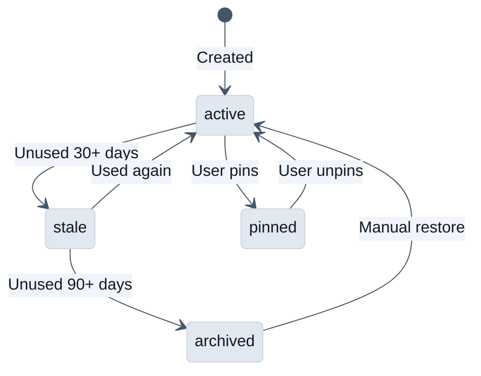

- **Active** — Loaded and available for execution
- **Stale** — Still loaded but flagged for review (unused for 30+ days)
- **Archived** — Moved to `data/skills/.archive/`, unregistered (unused for 90+ days)
- **Pinned** — User-protected, never auto-transitioned

Background maintenance runs every 6 hours to apply state transitions automatically.


### Monitoring & Health

```bash
# Full health report (all skills with usage stats, states, error rates)
curl http://localhost:8888/skills/health

```

The health report includes:
- Total active and archived skill counts
- Per-skill usage statistics (execution count, success/failure rate, average time)
- Lifecycle state for each skill
- Source classification (builtin vs. user-created)

---

## 📁 Project Structure

```
Clawzd/
├── main.py                  # Entry point — health check + FastAPI launch
├── config.py                # Centralized .env configuration
├── install.sh / run.sh / update.sh / uninstall.sh
├── requirements.txt         # Python dependencies
├── .env / .env.example      # Environment configuration
│
├── app/                     # Application modules
│   ├── gateway.py           # Central FastAPI app (285 routes)
│   ├── core/                # Agentic / Plugin core subsystems
│   │   ├── plugin_system.py # 7-hook plugin lifecycle
│   │   ├── tool_replay.py   # Tool execution recording
│   │   ├── app_builder.py   # LLM-driven mini-app generation
│   │   ├── dashboard.py     # System metrics aggregation
│   │   ├── artifacts.py     # Persistent artifact store
│   │   ├── upload_store.py  # Checksummed file registration
│   │   ├── notifications.py # In-app notification queue
│   │   └── structured_ui.py # Dynamic UI component rendering
│   ├── tools/               # Tool implementations
│   │   ├── contracts.py     # Pydantic tool schemas (14 tools)
│   │   └── output_validator.py # LLM output validation pipeline
│   ├── plugins/             # Auto-discovered plugins
│   │   ├── automation.py    # Auto-upload + smart notifications
│   │   └── context_enrichment.py # Prompt enhancement
│   ├── integrations/        # Discord, Telegram, Social
│   ├── ai_models/           # LLM providers and model management
│   ├── automation/          # Playbooks and cron tasks
│   └── skills/              # Dynamic skill registry and lifecycle
│
├── templates/               # Jinja2 HTML templates
│   ├── index.html           # Main entry (29 component assets)
│   └── partials/            # Header, sidebar, status bar, studios
├── static/
│   ├── css/
│   │   ├── style.css        # Main stylesheet
│   │   ├── responsive.css   # 5-breakpoint mobile CSS
│   │   └── components/      # Panel-specific styles (7 files)
│   ├── js/
│   │   ├── app.js           # Legacy application logic
│   │   ├── main.js          # ES module entry (panel init)
│   │   └── components/      # IIFE panel modules (10 files)
│   └── img/
├── data/                    # Runtime data (DB, sessions, replays, apps…)
├── workspace/               # User workspace for file operations
└── chroma_db/               # ChromaDB vector store
```

---

## 🔒 HTTPS / TLS Setup

Clawzd runs on HTTP by default. For production or remote access, use a reverse proxy with TLS:

### Nginx + Let's Encrypt

```nginx
server {
    listen 443 ssl http2;
    server_name clawzd.yourdomain.com;

    ssl_certificate /etc/letsencrypt/live/clawzd.yourdomain.com/fullchain.pem;
    ssl_certificate_key /etc/letsencrypt/live/clawzd.yourdomain.com/privkey.pem;

    location / {
        proxy_pass http://127.0.0.1:8888;
        proxy_http_version 1.1;
        proxy_set_header Upgrade $http_upgrade;
        proxy_set_header Connection "upgrade";
        proxy_set_header Host $host;
        proxy_set_header X-Real-IP $remote_addr;
        proxy_set_header X-Forwarded-For $proxy_add_x_forwarded_for;
        proxy_set_header X-Forwarded-Proto $scheme;

        # SSE support — disable buffering
        proxy_buffering off;
        proxy_cache off;
        proxy_read_timeout 300;
    }
}
```

### Security Hardening

| Feature | Config | Description |
|---------|--------|-------------|
| **Rate Limiting** | `RATE_LIMIT=30/minute` | Prevents abuse via slowapi |
| **CORS** | `CORS_ORIGINS=https://your.domain` | Restricts cross-origin access |
| **Input Sanitization** | Built-in | Script tags stripped from user input |
| **Sandbox** | Built-in | Code execution isolated with resource limits |

---

## 🤝 Contributing

1. Fork the repository
2. Create a feature branch: `git checkout -b feature/my-feature`
3. Commit your changes: `git commit -m 'feat: add my feature'`
4. Push to the branch: `git push origin feature/my-feature`
5. Open a Pull Request

---

<div align="center">

**Built with ❤️ using FastAPI, Ollama, and open-source AI models.**

</div>

---

## 🙏 Acknowledgements & Transparency

We would like to thank the following projects that served as inspiration for Clawzd:

### AI Assistants & Chat Interfaces
- [Open WebUI](https://github.com/open-webui/open-webui) — Self-hosted LLM web interface, chat UX patterns
- [AnythingLLM](https://github.com/Mintplex-Labs/anything-llm) — All-in-one AI desktop app with RAG
- [Abacus.ai](https://abacus.ai) — AI Data Analyst, Revenue Analytics Pro, Humanize Text features

### Agent Frameworks & Orchestration
- [Hermes Agent](https://github.com/NousResearch/hermes-agent) — Context compression, persistent memory, skill curator, tool output pruning
- [OpenMonoAgent](https://openmonoagent.ai) — Playbook architecture, file snapshot, undo, tool isolation, doom-loop detection
- [OpenCode](https://github.com/nichochar/open-code) — Agentic Build/Plan mode, @file fuzzy search, patch format, change history
- [Claude Code](https://docs.anthropic.com/en/docs/agents-and-tools/claude-code/overview) — FileReadTool, SnipTool, compact_boundary patterns
- [OpenClaw](https://github.com/openclaw/openclaw) — Studio runtime/summary dashboard architecture

### Research & Deep Analysis
- [GPT-Researcher](https://github.com/assafelovic/gpt-researcher) — Research progress tracking, cost callbacks, multi-source scraping
- [open_deep_research](https://github.com/langchain-ai/open_deep_research) — Research brief writing, topic prompt transformation
- [HyperAgents](https://github.com/agent-labs/hyperagents) — Archive.jsonl, select_next_parent mechanism, ensemble evaluation
- [Tongyi DeepResearch](https://github.com/QwenLM) — "Heavy Mode" / IterResearch iterative condensation paradigm
- [WebWeaver](https://arxiv.org/abs/2509.13312) — Web navigation and source selection strategies

### Media Generation
- [ComfyUI](https://github.com/comfyanonymous/ComfyUI) — Node-based image/video generation workflow
- [Stable Diffusion (Stability AI)](https://github.com/Stability-AI/stablediffusion) — Core image generation pipeline
- [AnimateDiff Lightning (ByteDance)](https://github.com/bytedance/AnimateDiff-Lightning) — Video generation from text
- [LTX-Video (Lightricks)](https://github.com/Lightricks/LTX-Video) — Text-to-video generation
- [Wan2.1 (Alibaba)](https://github.com/Wan-Video/Wan2.1) — Advanced video generation model
- [FLUX (Black Forest Labs)](https://github.com/black-forest-labs/flux) — High-quality image generation (Schnell, Klein)

### Infrastructure & Tools
- [Ollama](https://github.com/ollama/ollama) — Local LLM serving and model management
- [FastAPI](https://github.com/tiangolo/fastapi) — High-performance Python web framework
- [Playwright](https://github.com/microsoft/playwright) — Headless browser automation
- [Lightpanda](https://github.com/lightpanda-io/browser) — Ultra-lightweight headless browser for AI scraping
- [ChromaDB](https://github.com/chroma-core/chroma) — Vector database for RAG embeddings
- [RTK](https://github.com/nichochar/rtk) — Token compression techniques (60-90% context savings)

### Security & Quality
- [Trivy](https://github.com/aquasecurity/trivy) — SCA, misconfiguration, secrets, and license scanning
- [DeepEval](https://github.com/confident-ai/deepeval) — LLM response quality validation (relevancy, hallucination)
- [Semgrep](https://github.com/semgrep/semgrep) — OWASP, secrets, and CI code analysis

### Jailbreak & Prompt Engineering
- [L1B3RT4S](https://github.com/elder-plinius/L1B3RT4S) — Architecture-specific bypass prompt techniques
- [Obliteratus](https://github.com/elder-plinius/OBLITERATUS) — Advanced jailbreak prompt engineering

### Other Inspirations
- [Flickr](https://www.flickr.com) — Media gallery and lightbox UX patterns
- [Graphify](https://github.com/closedloop-technologies/graphify) — Data visualization approaches
