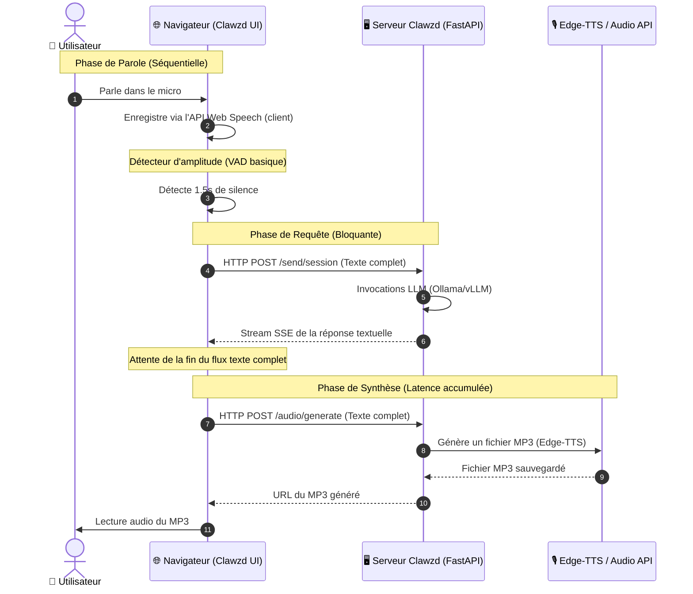
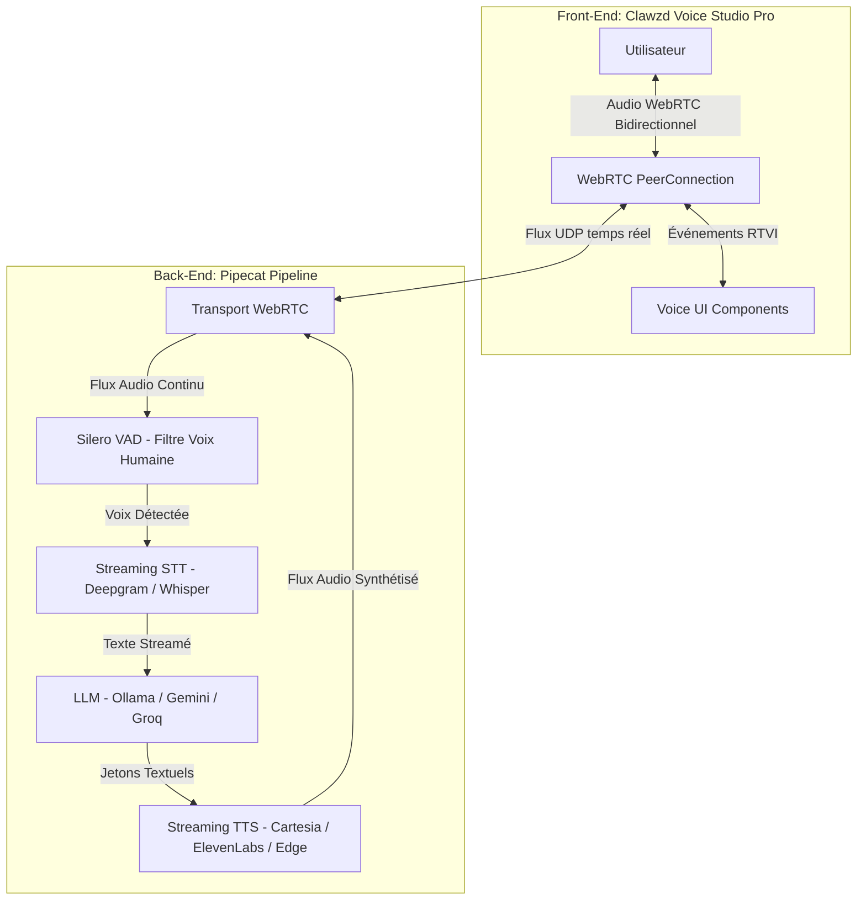

# Audit & Proposition d'Intégration : Clawzd Voice Pilot vs. Pipecat AI Voice UI Kit

Ce document présente un audit technique approfondi du module **Voice Studio** actuel de **Clawzd** face aux standards industriels de la voix en temps réel incarnés par le framework **Pipecat AI** et sa bibliothèque de composants **Voice UI Kit**. Il propose ensuite une stratégie d'architecture concrète pour combler les failles actuelles et intégrer l'expérience utilisateur ultra-fluide de Pipecat dans le socle technologique de Clawzd.

---

## 📊 Synthèse Comparative de l'Existant

Le module **Voice Studio** de Clawzd dispose déjà d'une interface en verre dépoli (glassmorphic) superbe, avec un orbite interactif animé par Canvas. Cependant, sous le capot, l'architecture d'interaction vocale repose sur un modèle web classique séquentiel (HTTP/SSE).



### Limites identifiées dans Clawzd :
1. **Latence excessive (3 à 8 secondes) :** Le flux est séquentiel. L'utilisateur doit finir de parler, le texte est envoyé, le LLM doit répondre en entier, le texte est envoyé à la synthèse, le fichier MP3 est entièrement généré et téléchargé, et *enfin* le navigateur le joue.
2. **Détection d'Activité Vocale (VAD) rudimentaire :** Le VAD actuel est basé sur une simple analyse d'amplitude du micro via l'API Web Audio. Elle est extrêmement sensible aux bruits de fond, provoquant de fausses soumissions ou bloquant la parole dans les environnements bruyants.
3. **Gestion asynchrone des interruptions (Client-Only) :** Si l'utilisateur interrompt le robot en parlant, l'audio du navigateur est coupé localement. Cependant, **le serveur n'en sait rien**. La mémoire de la session LLM conserve l'intégralité de la réponse pourtant coupée en plein milieu par l'utilisateur, ce qui brise le contexte de la conversation.
4. **Dépendance aux navigateurs pour la transcription (STT) :** L'utilisation de `webkitSpeechRecognition` implique une dépendance totale à l'implémentation du navigateur de l'utilisateur (excellente sous Google Chrome, mais inexistante ou désastreuse sous Firefox et Safari sans configuration manuelle complexe).

---

## 🛠️ Audit de Pipecat AI & Voice UI Kit

**Pipecat AI** est un framework spécialisé dans les agents vocaux et multimodaux conversationnels en temps réel. Il introduit la norme **RTVI (Real-Time Voice Interaction)**.



### Comment fonctionne Pipecat :
- **Transport WebRTC (UDP) :** Au lieu d'utiliser des requêtes HTTP classiques, la voix de l'utilisateur est diffusée en continu sous forme de paquets UDP à ultra-basse latence.
- **Pipelining par Trames (Frames) :** Le traitement se fait à la volée. Dès que le LLM génère les premiers mots, ils sont immédiatement transmis au synthétiseur vocal (TTS) qui commence à diffuser le flux audio vers l'utilisateur avant même que le LLM n'ait fini sa phrase.
- **Interruption native au niveau du Pipeline :** Si le VAD détecte que l'utilisateur commence à parler pendant que le robot s'exprime, il envoie un signal d'interruption instantané. Le serveur coupe immédiatement la génération LLM et l'audio TTS à la milliseconde près, et met à jour l'historique de la conversation pour qu'il s'arrête exactement au mot prononcé lors de la coupure.

### Ce qu'apporte le Voice UI Kit :
Le **Voice UI Kit** de Pipecat fournit les composants d'interface prêts à l'emploi (habituellement en React) pour gérer cette communication RTVI :
- **États de Session unifiés :** Gère nativement les transitions (`idle` ➔ `connecting` ➔ `connected` ➔ `ready` ➔ `disconnecting` ➔ `error`).
- **Indicateurs de volume dynamiques :** Visualisation précise des fréquences de la voix de l'utilisateur et de celle du bot.
- **Flux de transcription en temps réel :** Affiche le texte mot à mot dès qu'il est prononcé ou généré.
- **Console de Débogage WebRTC :** Télémétrie en temps réel montrant la latence, la gigue (jitter), et la perte de paquets.

---

## 🔍 Analyse d'Écart (Gap Analysis)

| Fonctionnalité | Clawzd (Actuel) | Pipecat + Voice UI Kit (Cible) | Impact sur l'Expérience Utilisateur |
| :--- | :--- | :--- | :--- |
| **Protocole réseau** | HTTP / SSE (TCP) | WebRTC / RTVI (UDP) | **Crucial** : Réduction de la latence de ~5s à < 800ms. |
| **Type de dialogue** | Séquentiel (Tour par tour) | Temps réel continu (Full-Duplex) | **Élevé** : La conversation devient naturelle, fluide, sans blancs. |
| **VAD (Détection voix)** | Amplitude locale | Silero VAD (Réseau de neurones sur serveur) | **Très Élevé** : Plus de faux déclenchements avec le bruit ambiant. |
| **STT (Transcription)** | API Web Speech (Navigateur) | Centralisé sur Serveur (Whisper/Deepgram) | **Élevé** : Compatibilité totale et identique sur Firefox/Safari/Chrome. |
| **Gestion d'Interruption** | Pause audio client-side | Réinitialisation complète du Pipeline | **Crucial** : La session LLM reste 100% alignée avec ce que l'utilisateur a entendu. |
| **Indicateurs Vocaux** | Cercle Canvas basique | Ondes sinusoïdales réactives multi-fréquences | **Moyen** : Esthétique premium et sentiment de vie artificielle. |
| **Télémétrie & Logs** | Logs bruts de transcript | Console de performance WebRTC (RTT, Jitter) | **Moyen** : Utile pour le diagnostic réseau local / distant. |

---

## 💡 Proposition : Stratégie de Portages & Intégration (Vanilla JS/CSS)

Puisque Clawzd est conçu sur une architecture **HTML standard + Javascript Vanilla (modules ES6) + CSS natif**, nous ne pouvons pas intégrer directement le package React de `@pipecat-ai/voice-ui-kit`. 

Nous proposons de créer le **Clawzd Voice Studio Pro**, un portage natif et optimisé en Javascript Vanilla des concepts clés du Voice UI Kit de Pipecat, connecté à un serveur Pipecat en Python.

---

## 🚀 Fonctionnalités à Ajouter à Clawzd

### 1. Interface Utilisateur : Le "Siri Waveform Visualizer" (Portage UI Kit)
Au lieu d'un cercle Canvas à oscillation uniforme, nous proposons d'intégrer un visualiseur multi-ondes fluide lisant les données fréquentielles directes via l'API WebAudio (depuis les flux WebRTC locaux et distants).

```css
/* static/css/components/voice_rtvi.css */
:root {
  --voice-glow-idle: rgba(139, 92, 246, 0.4);
  --voice-glow-active: rgba(59, 130, 246, 0.8);
  --voice-glow-speaking: rgba(16, 185, 129, 0.8);
  --voice-glow-thinking: rgba(245, 158, 11, 0.7);
}
.voice-sphere-container {
  position: relative;
  display: flex;
  justify-content: center;
  align-items: center;
}
/* Floutage d'arrière-plan haut de gamme pour l'orb */
.voice-sphere-glow-layer {
  position: absolute;
  width: 250px;
  height: 250px;
  border-radius: 50%;
  filter: blur(50px);
  opacity: 0.15;
  transition: all 0.5s ease;
}
```

```javascript
// static/js/studios/voice_rtvi_client.js
// Classe chargée de simuler l'état RTVI standard dans l'orb standard
class RTVILiteVisualizer {
  constructor(canvasId) {
    this.canvas = document.getElementById(canvasId);
    this.ctx = this.canvas.getContext('2d');
    // Gestion de 3 ondes sinusoïdales superposées avec déphasages
    this.waves = [
      { amplitude: 15, speed: 0.08, phase: 0, color: 'rgba(99, 102, 241, 0.6)' },
      { amplitude: 25, speed: 0.04, phase: 120, color: 'rgba(139, 92, 246, 0.4)' },
      { amplitude: 10, speed: 0.12, phase: 240, color: 'rgba(6, 182, 212, 0.5)' }
    ];
  }
  // Animation fluide style Siri
  draw(level, state) {
    const w = this.canvas.width;
    const h = this.canvas.height;
    this.ctx.clearRect(0, 0, w, h);
    
    // Dessiner chaque onde
    this.waves.forEach(wave => {
      wave.phase += wave.speed;
      this.ctx.beginPath();
      this.ctx.strokeStyle = wave.color;
      this.ctx.lineWidth = 2.5;
      
      for (let x = 0; x < w; x++) {
        // Modulation par courbe en cloche pour aplatir les extrémités
        const normalize = Math.sin((x / w) * Math.PI);
        const y = h/2 + Math.sin(x * 0.02 + wave.phase) * wave.amplitude * normalize * (level * 2.5 + 0.1);
        if (x === 0) this.ctx.moveTo(x, y);
        else this.ctx.lineTo(x, y);
      }
      this.ctx.stroke();
    });
  }
}
```

### 2. Le Panneau de Débogage WebRTC & Télémétrie
Un panneau collatéral escamotable affichant les statistiques réseau réelles de l'API RTVI pour diagnostiquer les performances :

```html
<!-- templates/partials/voice_studio.html (Section Télémétrie) -->
<div class="voice-telemetry-panel glass-panel collapsible collapsed">
  <div class="telemetry-header">
    <h4>Télémétrie RTVI / WebRTC</h4>
  </div>
  <div class="telemetry-grid">
    <div class="tel-item">
      <span class="tel-label">Latence RTT</span>
      <span class="tel-val" id="rtvi-rtt">-- ms</span>
    </div>
    <div class="tel-item">
      <span class="tel-label">Gigue (Jitter)</span>
      <span class="tel-val" id="rtvi-jitter">-- ms</span>
    </div>
    <div class="tel-item">
      <span class="tel-label">Pertes Paquets</span>
      <span class="tel-val" id="rtvi-losses">0%</span>
    </div>
    <div class="tel-item">
      <span class="tel-label">Vitesse Audio</span>
      <span class="tel-val" id="rtvi-bitrate">-- kbps</span>
    </div>
  </div>
</div>
```

### 3. La Transcription mot à mot synchronisée (Subtitles)
Dans les logs parlés, ajouter un effet de surbrillance active sur le mot en cours de lecture par le TTS, permettant de suivre visuellement le discours de Clawzd à l'écran.

---

## 🛠️ Plan d'Implémentation Technique Étape par Étape

### Étape 1 : Ajout des dépendances Python requises
Ajouter les packages requis par Pipecat dans `requirements.txt` :
```text
pipecat-ai>=0.3.0
daily-python>=0.8.0
aiortc>=1.6.0  # Pour un transport WebRTC local sans service tiers
```

### Étape 2 : Création du Routeur Pipecat FastAPI (`app/routers/voice_rtvi.py`)
Ce fichier configure le pipeline et gère l'orchestration des trames entre le microphone WebRTC et l'IA.

```python
# [NEW] app/routers/voice_rtvi.py
from fastapi import APIRouter, WebSocket, WebSocketDisconnect
from pipecat.services.ollama import OllamaLLMService
from pipecat.services.edge_tts import EdgeTTSService
from pipecat.pipeline.pipeline import Pipeline
from pipecat.pipeline.runner import PipelineRunner
from pipecat.transports.network.web_rtc import WebRTCTransport

router = APIRouter(prefix="/voice/rtvi", tags=["Voice RTVI"])

@router.websocket("/session")
async def websocket_rtvi_endpoint(websocket: WebSocket):
    await websocket.accept()
    
    # 1. Configurer le transport (WebRTC via WebSockets)
    transport = WebRTCTransport(...)
    
    # 2. Configurer les services
    # Permet de conserver l'architecture locale de Clawzd
    llm = OllamaLLMService(model="qwen3.5:9b")
    tts = EdgeTTSService(voice="fr-FR-DeniseNeural")
    
    # 3. Assembler le pipeline Pipecat avec VAD intégré
    pipeline = Pipeline([
        transport.input(),    # Reçoit l'audio de l'utilisateur
        llm,                  # Génère le texte
        tts,                  # Synthétise en audio
        transport.output()    # Renvoie le son en temps réel
    ])
    
    # Exécuter le pipeline de manière asynchrone
    runner = PipelineRunner()
    try:
        await runner.run(pipeline)
    except WebSocketDisconnect:
        await runner.stop()
```

### Étape 3 : Création du Client WebRTC en Javascript Vanilla (`static/js/studios/voice_rtvi_client.js`)
Ce fichier remplace `voice.js` pour gérer la connexion en temps réel bidirectionnelle.

```javascript
// [NEW] static/js/studios/voice_rtvi_client.js
class VoiceStudioRTVIPilot {
  constructor() {
    this.peerConnection = null;
    this.visualizer = new RTVILiteVisualizer('voice-sphere-canvas');
    this.status = 'idle';
  }

  async connect() {
    this.status = 'connecting';
    this.updateUI();

    // 1. Initialiser la connexion WebSocket pour le signalement WebRTC
    this.ws = new WebSocket(`ws://${window.location.host}/voice/rtvi/session`);
    
    // 2. Créer l'objet RTCPeerConnection pour l'audio temps réel
    this.peerConnection = new RTCPeerConnection({
      iceServers: [{ urls: 'stun:stun.l.google.com:19302' }]
    });

    // 3. Capturer le flux micro local et l'ajouter à WebRTC
    const localStream = await navigator.mediaDevices.getUserMedia({ audio: true });
    localStream.getTracks().forEach(track => this.peerConnection.addTrack(track, localStream));

    // 4. Recevoir le flux audio distant (La voix de l'IA)
    this.peerConnection.ontrack = (event) => {
      const remoteAudio = new Audio();
      remoteAudio.srcObject = event.streams[0];
      remoteAudio.play();
    };

    // Gestion du VAD et des statistiques réseau
    this.startStatsMonitoring();
  }
  
  // Analyse en direct de la gigue et de la latence du canal WebRTC
  async startStatsMonitoring() {
    setInterval(async () => {
      if (!this.peerConnection) return;
      const stats = await this.peerConnection.getStats();
      stats.forEach(report => {
        if (report.type === 'candidate-pair' && report.state === 'succeeded') {
          document.getElementById('rtvi-rtt').textContent = `${Math.round(report.currentRoundTripTime * 1000)} ms`;
        }
      });
    }, 1000);
  }
}
```

### Étape 4 : Intégration dans le Tableau de Bord
Ajouter le fichier JS à `templates/index.html` :
```html
<script src="{{ url_for('static', path='js/studios/voice_rtvi_client.js') }}" type="module"></script>
```

Et mettre en place un commutateur (Toggle) dans le panneau de gauche de **Voice Studio** pour permettre à l'utilisateur de choisir entre :
- **Mode Séquentiel (Standard)** : Entièrement hors-ligne, compatible avec tous les navigateurs sans WebRTC.
- **Mode Conversationnel (Pipecat Pro)** : Temps réel ultra-fluide avec interruption intelligente.

---

## 🔮 Avantages Majeurs de cette Intégration pour Clawzd

1. **Expérience utilisateur immersive :** Passer d'une interaction "talkie-walkie" (attendre 5 secondes) à un vrai dialogue instantané avec une latence quasi humaine (<800ms).
2. **Robustesse et Portabilité :** En externalisant la transcription (STT) et le VAD sur le serveur via Pipecat, le client Web lourd devient extrêmement léger. Les utilisateurs de Firefox, Safari ou navigateurs mobiles auront exactement la même expérience impeccable que sur Chrome.
3. **Pilotage complexe par la voix fluide :** Grâce à l'interruption instantanée du flux, l'utilisateur peut enfin interrompre une tâche complexe lancée par erreur, corriger un script généré en disant simplement *"Non, change la fonction X en Y"*, sans avoir à attendre la fin du rendu audio.
4. **Conservation de l'autonomie 100% locale :** En utilisant un transport local comme `aiortc` couplé à Ollama (LLM) et Edge-TTS (TTS local/léger), cette intégration respecte scrupuleusement le principe fondateur de Clawzd : **conserver toutes vos données et vos calculs sur votre propre machine**.
